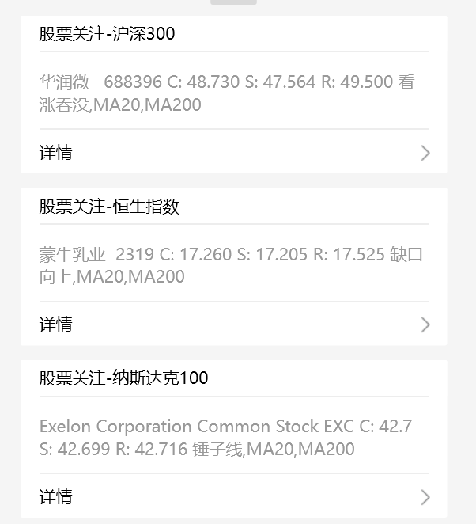
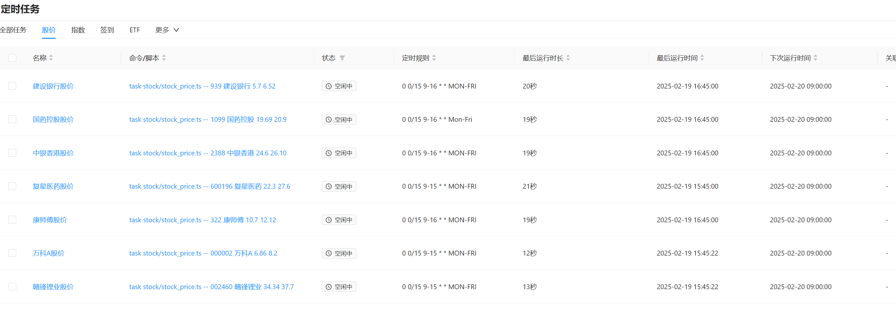

# trading-bot

A simple trading bot for the Stock exchange written in Rust.

- 同步上交所、深交所、港交所、纳斯达克交易主要指数中的股票；
- 从上交所、深交所、港交所、纳斯达克交易所获取主要指数中股票的日线数据、基金的日线数据；
- 分析股票、基金的价格是否满足蜡烛的形态，成交量条件，均线指标；
- 将选出的股票、基金，计算股票、基金的最近支撑价，最近阻力价，通过message-hub推送指定的微信账号；
- 依赖定时任务组件，定时查询股票、基金的价格，并提醒。

## 效果图

### 消息推送

### 基于青龙面板定时查询股价并推送消息

## 免责声明

- 本项目仅供学习参考，请勿用于非法用途。
- 股票、基金数据来自证券交易所官网，数据只有日线价格，暂未实现分时线数据。
- 只能用于选股，实际交易请根据个人投资经验决定。
- 股市有风险，投资需谨慎。
